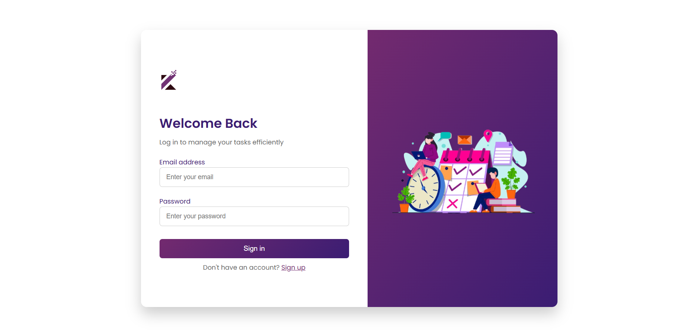
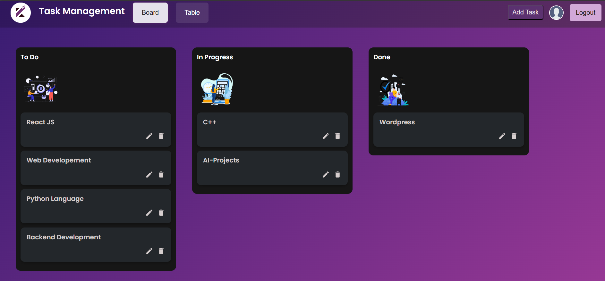
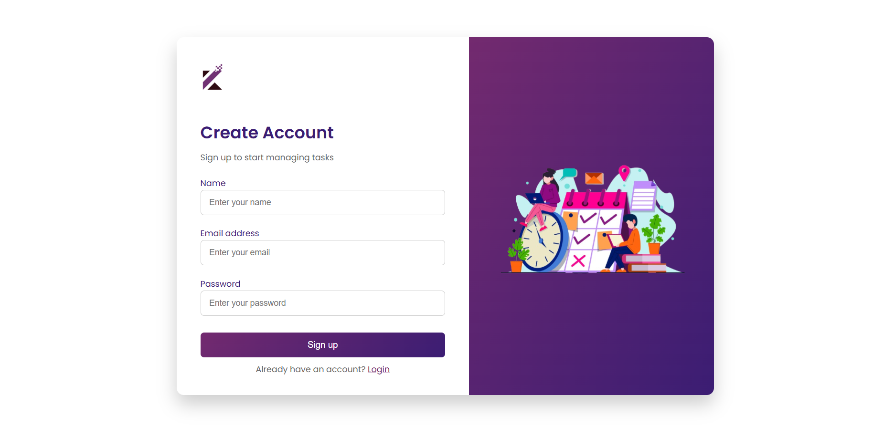
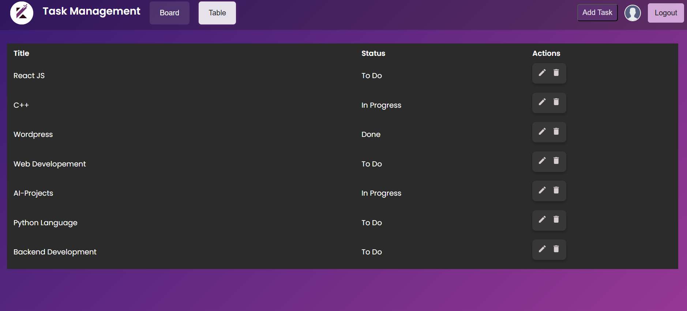

# 📝 Task Manager App(To-do-List)

A simple and efficient **Task Manager App** web application built using React and Node.js.  
This project helps users organize, track, and manage their daily tasks with a clean and responsive interface.

---

## 🚀 Features
- 🔐 **User Authentication** — Secure login and signup using **JWT (JSON Web Token)**
- 🔒 **Password Encryption** — All passwords hashed using **bcrypt**
- 📋 **CRUD Operations** — Add, edit, delete, and view tasks
- 🧩 **Draggable Tasks** — Reorder tasks easily via drag-and-drop UI
- ✅ **Task Status Control** — Mark tasks as completed or pending
- 🌐 **API Communication** — Frontend uses **Axios** for all API requests

---

## 🧠 Project Summary
This Task Manager App allows users to manage their daily activities easily.  
Frontend is developed with **React.js** for a smooth and dynamic user experience,  
while the **Node.js + Express** backend handles data management.  


---

## 🧰 Technologies Used
| Category | Technologies |
|-----------|---------------|
| **Frontend** | React.js, HTML5, CSS3, Axios|
| **Backend** | Node.js, Express.js,JWT, bcrypt |

---

## 🖼️ Output 

Below is the screenshot of the final application UI:







---

## ⚙️ How It Works

1. **Start the Backend**
 ```bash
  cd backend
  npm install
  npm run dev
